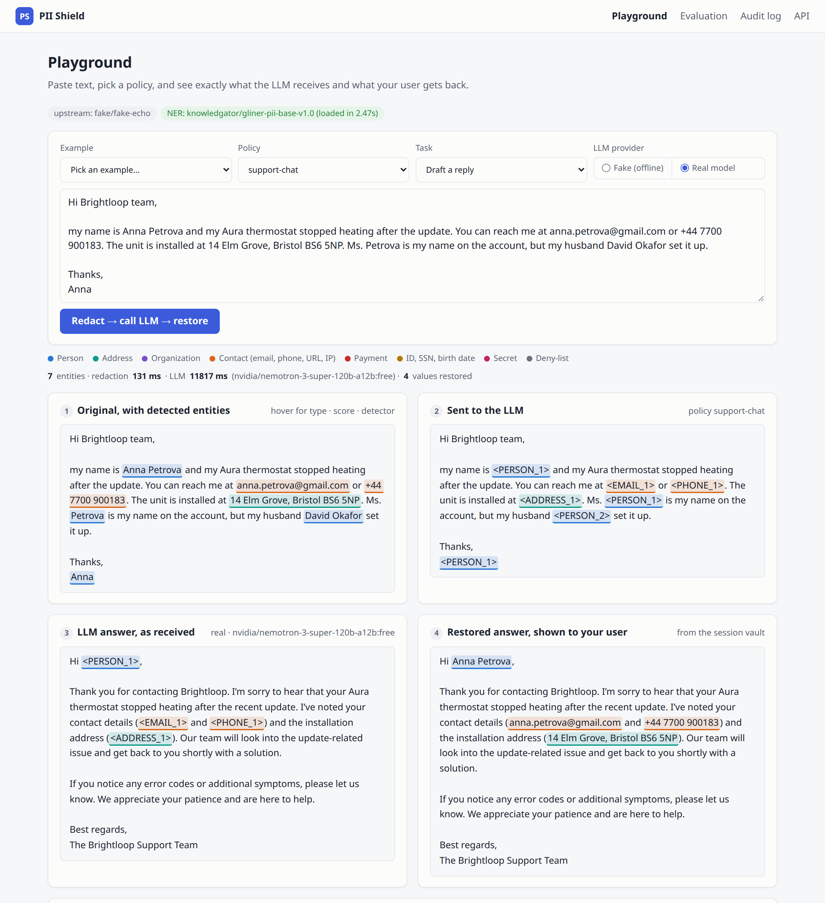
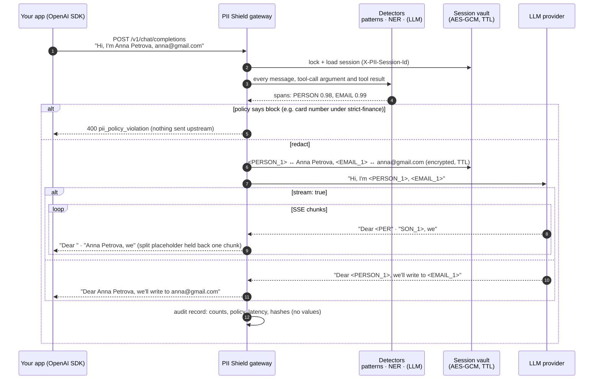
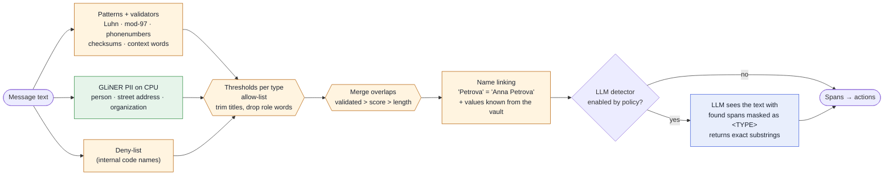
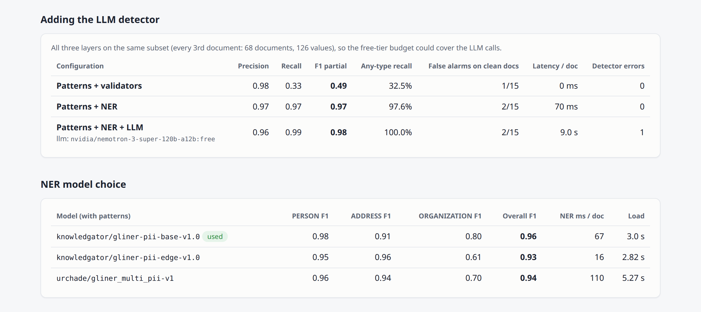
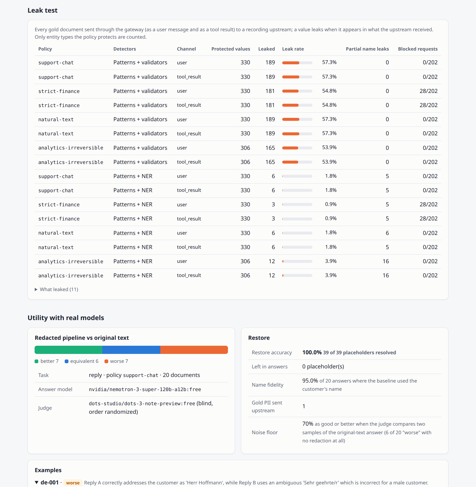

# PII Shield: strip personal data before it reaches an LLM, and put it back in the answer

**An OpenAI-compatible gateway and Python library that replaces names, emails, card numbers and secrets with placeholders before a request leaves your network, and restores the real values in the model's answer.**

[](https://github.com/gelevanog/pii-redaction-gateway/actions/workflows/ci.yml)




<sub>The playground with a real free model (`nvidia/nemotron-3-super-120b-a12b:free`): (1) detected entities, (2) the only text the provider sees, (3) its raw answer, (4) the answer your user gets.</sub>

**Measured on 2026-10-05** on a hand-labeled gold set of 202 documents (330 PII values, 13 entity types, 5 languages), CPU only:

| | Result |
|---|---|
| Gold PII values that reached the LLM provider (support policy, patterns + NER) | **6 of 330 (1.8%)**; with patterns only: 189 of 330 (57%) |
| Detection, patterns + NER: precision / recall / F1 (partial match) | **0.94 / 0.98 / 0.96**; on the 36-document held-out split: 0.97 / 0.96 / 0.96 |
| Adding the optional LLM detector (free model, 68-document subset) | recall 0.97 → **0.99**, every gold value covered, but **9 s** per document |
| Redaction latency per document (patterns + GLiNER on CPU) | **67 ms** mean, 80 ms p95 |
| Placeholders in real model answers that were restored to the right value | **39 of 39 (100%)** |
| Answer quality, redacted vs original text, judged blind by a second model | **65% as good or better** (13 of 20), against a noise floor of **70%** for two samples of the same original-text prompt |

**The honest verdict:** patterns with validators are precise but only catch structured data (43% of the gold values). A small GLiNER model on CPU closes most of the gap (98% of values redacted at 67 ms per document); what still slips through is a lone first name ("Claire"), a lowercase name, a Russian and one US street address, and two secret formats the patterns do not know. An LLM detector catches those too, but at seconds per request it belongs in batch jobs, not in a chat gateway. Placeholders are restored reliably, and the quality cost is small (about one reply in twenty below the judge's own noise level), with visible causes: a placeholder hides the customer's gender (German "Sehr geehrte/r" instead of "Herr"), and a policy that masks an IBAN means the reply cannot confirm it. Details, error analysis and every number's source are below.

## What problem it solves

Teams want to use ChatGPT, Claude or any other hosted LLM on customer data: support tickets, CRM notes, emails, chat logs. But that data contains names, phone numbers, addresses, card numbers and sometimes passwords, and contracts, GDPR, HIPAA or the security team often say it must not be sent to a third party.

PII Shield sits between your application and the LLM provider. It finds the personal data in every request, replaces it with placeholders such as `<PERSON_1>` and `<EMAIL_1>` (or realistic fake values, a mask, a one-way hash, or refuses the request outright), sends only that to the provider, and swaps the real values back into the answer. Your users see "Dear Anna Petrova, we will email anna.petrova@gmail.com"; the provider only ever saw `<PERSON_1>` and `<EMAIL_1>`. Because it speaks the OpenAI API, adopting it is a one-line change in your code: point `base_url` at the gateway.

It helps with data minimization and with keeping personal data inside your infrastructure. It is not legal advice and not a compliance certification: no detector catches 100% of personal data (the numbers above show exactly how much this one misses on its test set).

## Features

- **Drop-in OpenAI-compatible gateway** (FastAPI): `POST /v1/chat/completions`, streaming (SSE) included. Works with the OpenAI SDKs in any language, LangChain, LlamaIndex, or plain HTTP.
- **Everything is redacted**: system, user, assistant and tool messages, multi-part text content, and string values inside tool-call arguments (parsed as JSON, so arguments stay valid JSON). **Restored**: answer text and tool-call arguments, so when the model calls `send_email(to="<EMAIL_1>")` your tool receives the real address.
- **Streaming restore** with a small hold-back buffer for placeholders split across chunks (`<PER` + `SON_1>`), tested at every possible split point.
- **Layered, pluggable detection**:
  - patterns with validators: email (also obfuscated, "anna dot petrova at gmail dot com", "punkt", "arroba"), phone (`phonenumbers`, 8 regions), credit card (Luhn + issuer), IBAN (ISO 13616 mod-97), IPv4/IPv6, personal URLs (profiles, reset links, URLs carrying emails), US SSN, Spanish DNI/NIE (mod-23 letter) and Dutch BSN (11-test), dates of birth in context (EN/DE/ES/NL/RU), secrets (OpenAI/Anthropic/GitHub/GitLab/Slack/AWS/Google/Stripe prefixes, JWTs, private keys, bearer tokens, connection strings, `password=` assignments, high-entropy tokens next to a keyword);
  - NER for names, street addresses and organizations: GLiNER PII (`knowledgator/gliner-pii-base-v1.0`) on CPU, chosen by measurement against two alternatives;
  - an optional LLM detector for contextual leftovers (structured JSON output, off by default). It only sees the text after patterns and NER have masked what they found.
- **Conflict resolution and name linking**: overlapping spans are merged deterministically (validated beats unvalidated, then score, then length); titles and possessives are trimmed; "Anna Petrova", "Ms. Petrova" and "Anna" become one `<PERSON_1>`, within a message and across a conversation; role words ("the customer", "IT manager") are never names.
- **Six actions per entity type**: reversible placeholder, reversible realistic synthetic value (Faker, format-preserving: Luhn-valid cards, mod-97-valid IBANs, SSNs in the never-issued 9xx range, emails at `example.com`, IPs in documentation ranges), mask (`**** 1234`), keyed one-way hash (`<EMAIL:3f2a9c1b>`, joinable across records), block (refuse the request), keep.
- **Policies in YAML** per tenant or route: actions, confidence thresholds per entity type, allow-lists (your brand, public support addresses), deny-lists (internal code names), detector layers, fail-closed. Four examples ship: `support-chat`, `strict-finance`, `natural-text`, `analytics-irreversible`.
- **Session vault**: placeholder ↔ original per conversation, **AES-256-GCM encrypted at rest** with the session id bound as associated data, with a TTL; in-memory, Redis (several replicas) or file (CLI) backend; per-session locking.
- **Audit log without PII**: entity counts by type and action, policy, latencies, upstream model, keyed hashes of the request and session. `GET /audit` and a [dashboard page](docs/screenshots/audit-log.png). Logs never contain values (a structlog processor drops text-carrying keys as a last line of defence).
- **Providers**: `fake` (deterministic offline echo bot, so tests, CI and the Docker demo need no keys), OpenRouter (with a `models` fallback list), OpenAI, Anthropic (official SDK, OpenAI ↔ Messages conversion including tool calls and streaming). The OpenRouter path ran against the live API for every number in this README; the OpenAI and Anthropic paths are unit-tested (request shapes, conversion, error mapping) but were not run against those live APIs here. A **free-only guard** refuses any OpenRouter model id that does not end in `:free`, also checking the model that actually answered.
- **Dashboard** (Jinja2 + htmx, no build step): the four-panel playground with a fake/real model toggle, the evaluation results and the audit log.
- **Evaluation you can rerun**: hand-labeled gold set, P/R/F1 per entity type and detector layer (strict, partial, any-type), a leak test through the real gateway, a real-model utility test with an LLM judge and its noise floor, property-based round-trip tests.

## How a request flows



**Detection pipeline.** Each layer is timed separately; a layer that fails is reported, and under a fail-closed policy the request is refused instead of being sent half-redacted.



## Drop-in usage

Start the gateway (`make serve` or `docker compose up`), then change only the base URL.

**Python (OpenAI SDK):**

```python
from openai import OpenAI

client = OpenAI(
    base_url="http://localhost:8000/v1",            # or /p/strict-finance/v1 to pick a policy by route
    api_key="gateway-key-or-anything",               # the gateway's own provider key is used upstream
    default_headers={"X-PII-Session-Id": "ticket-48213"},  # same id = same placeholders across turns
)
reply = client.chat.completions.create(
    model="auto",  # the gateway's configured model, or any model id your upstream accepts
    messages=[{"role": "user", "content": "Hi, I'm Anna Petrova (anna.petrova@gmail.com). My heating is broken."}],
)
print(reply.choices[0].message.content)  # "Hi Anna Petrova, ..." - the provider only saw <PERSON_1>
```

**TypeScript (OpenAI SDK):**

```ts
import OpenAI from "openai";

const client = new OpenAI({
  baseURL: "http://localhost:8000/v1",
  apiKey: process.env.GATEWAY_KEY ?? "unused",
  defaultHeaders: { "X-PII-Session-Id": conversationId, "X-PII-Policy": "support-chat" },
});

const stream = await client.chat.completions.create({
  model: "auto",
  messages: [{ role: "user", content: ticketText }],
  stream: true,
});
for await (const chunk of stream) process.stdout.write(chunk.choices[0]?.delta?.content ?? "");
```

**As a library** (no gateway, no network):

```python
from pii_shield import Shield

shield = Shield.create("support-chat", ner=True)   # ner=True needs `pip install "pii-shield[ner]"`

result = shield.redact("Hi, I'm Anna Petrova, card 4111 1111 1111 1111, call +44 7911 123456")
result.text       # "Hi, I'm <PERSON_1>, card **** **** **** 1111, call <PHONE_1>"
result.entities   # type, offsets, score, detector, action, replacement
shield.restore("Dear <PERSON_1>, we'll call <PHONE_1>.", result)  # "Dear Anna Petrova, we'll call +44 7911 123456."

with shield.session("conversation-42") as s:       # one locked vault session for several messages
    s.redact(message_1)
    s.redact(message_2)                            # same person -> same placeholder
    answer = s.restore(llm_answer)
```

**HTTP and CLI** for non-chat use:

```bash
curl -s localhost:8000/v1/redact -H 'content-type: application/json' -d '{"text": "Mail anna@gmail.com", "policy": "support-chat"}'
curl -s localhost:8000/v1/restore -H 'content-type: application/json' -d '{"text": "Wrote to <EMAIL_1>", "session_id": "..."}'

export PII_SHIELD_VAULT_KEY=$(uv run pii-shield keygen)
echo "Call Anna Petrova on +44 7911 123456" | uv run pii-shield redact --session demo   # Call <PERSON_1> on <PHONE_1>
uv run pii-shield restore --session demo "We called <PERSON_1>."                        # We called Anna Petrova.
```

Response headers carry `X-PII-Session-Id`, `X-PII-Policy` and `X-PII-Entities` (a count). A blocked request returns HTTP 400 with an OpenAI-style error (`type: pii_policy_violation`, `code: pii_blocked`, the entity types but never the values), so OpenAI SDKs raise a normal `BadRequestError`.

## Policies

A policy decides, per entity type, what happens to a detected value and how confident the detector must be. Policies are YAML files ([`src/pii_shield/policies/`](src/pii_shield/policies)); `pii-shield policies strict-finance` prints the resolved table.

```yaml
# src/pii_shield/policies/strict-finance.yaml
name: strict-finance
description: Fail-closed finance policy. Blocks cards, SSNs and secrets; lower thresholds; everything else pseudonymized.
default_action: pseudonymize        # pseudonymize | synthetic | mask | hash | block | keep
min_score: 0.4                      # default confidence threshold
entities:
  PERSON: {action: pseudonymize, threshold: 0.4}
  ORGANIZATION: {action: pseudonymize, threshold: 0.4}
  PHONE: {action: pseudonymize, threshold: 0.3}
  CREDIT_CARD: {action: block}      # refuse the request; nothing is sent upstream
  US_SSN: {action: block}
  SECRET: {action: block}
allow_list:
  - Brightloop                      # the operator's own brand is not personal data
deny_list: []                       # e.g. {value: "Project Falcon", entity: CUSTOM}
detectors: {patterns: true, ner: true, llm: false}
link_name_variants: true
fail_closed: true                   # a detector the policy relies on fails -> refuse, don't send half-redacted text
```

| Policy | For | Highlights |
|---|---|---|
| `support-chat` (default) | drafting replies, summarizing tickets | placeholders for people and contact data, cards and IBANs masked to the last 4, pasted passwords masked, brand and public support addresses allow-listed |
| `strict-finance` | back office, banking | blocks cards, SSNs and secrets; lower thresholds (recall over precision); organizations redacted too |
| `natural-text` | rewriting, creative tasks where placeholders hurt | realistic synthetic stand-ins, reversed in the answer |
| `analytics-irreversible` | exports, analytics, training data | keyed hashes (same customer joins across rows, no way back), masks; nothing is ever restored |

A policy is selected by route (`/p/<policy>/v1/...`, for clients that cannot set headers), by the `X-PII-Policy` header, or by tenant: with a tenants file ([`configs/tenants.example.yaml`](configs/tenants.example.yaml)) the gateway requires an API key, maps it (by SHA-256) to a tenant and its allowed policies, and never forwards the client's key upstream.

## Results: real runs on 2026-10-05

Everything below was produced by `configs/eval.yaml` on a 16-core machine without a GPU that was shared with other heavy jobs during the runs (latencies are realistic, not best-case). The artifacts are committed in [`results/`](results): [`detection.json`](results/detection.json) (with every miss and false alarm per configuration), [`leak.json`](results/leak.json), [`utility.json`](results/utility.json) (with every answer and judge verdict), the [call ledger](results/calls.jsonl) and the generated [`report.md`](results/report.md).

| Role | Model (every real call used a `:free` OpenRouter model) |
|---|---|
| NER | `knowledgator/gliner-pii-base-v1.0` (local, CPU, 4 threads) |
| LLM detector | `nvidia/nemotron-3-super-120b-a12b:free`, fallback `dots-studio/dots-3-note-preview:free` |
| Utility: answering model | `nvidia/nemotron-3-super-120b-a12b:free`, fallback `qwen/qwen3.8-27b:free` |
| Utility: judge (a different model family) | `dots-studio/dots-3-note-preview:free`, fallback `google/gemma-4-31b-it:free` |


<details><summary>More of the evaluation page: the LLM layer, NER model choice, leak test and utility</summary>




</details>

### The gold set

202 documents written and labeled one by one for this repository: support tickets, emails, CRM notes, chat logs, HR and medical-style notes and application logs, in English plus German, Spanish, Russian, Dutch and mixed-language texts; 50 documents contain no PII and must stay untouched. **It was not produced by a generation pipeline: no LLM API was called to write or label it, and no detector output was copied into the labels.** It is full of deliberate traps: names that are also words ("Will the update fix it? My neighbour Will Turner…", "Rose gold… Regards, Rose Alvarez"), 16-digit tracking numbers that fail Luhn, an IBAN-shaped booking code that fails mod-97, version strings shaped like IPs, dates that are not birth dates, obfuscated emails, hex digests and UUIDs that are not secrets. The markup source is human-readable ([`data/gold/source/`](data/gold/source)), and [the data card](data/gold/README.md) has the labeling guidelines.

**Development vs held-out.** I built the pattern recognizers while looking at the first 166 documents, so their scores there are optimistic. The last 36 documents ([`10-holdout.txt`](data/gold/source/10-holdout.txt)) were written after the recognizers and NER post-processing were frozen and were not used for tuning; they are reported separately.

### Detection

| Configuration | Precision (strict / partial) | Recall (strict / partial) | F1 strict | F1 partial | Gold values redacted at all | Clean documents flagged | Latency per document |
|---|---:|---:|---:|---:|---:|---:|---:|
| Patterns + validators | 0.98 / 0.99 | 0.42 / 0.43 | 0.59 | 0.60 | 42.7% | 2 / 50 | 0.4 ms |
| **Patterns + NER** (default) | 0.93 / 0.94 | 0.97 / 0.98 | 0.95 | **0.96** | **98.2%** | 7 / 50 | 67 ms mean, 80 ms p95 |
| Held-out split only (36 docs), patterns + NER | 0.96 / 0.97 | 0.94 / 0.96 | 0.95 | 0.96 | 97.1% | | |

Strict needs exact boundaries; partial counts an overlapping span of the right type; "redacted at all" counts a gold value as covered when any detected span overlaps it, whatever the type (a name tagged as an organization is still not sent).

Per entity type (patterns + NER, partial match):

| Entity | Gold | Precision | Recall | F1 | Comment |
|---|---:|---:|---:|---:|---|
| PERSON | 139 | 0.98 | 0.99 | 0.98 | misses: "Claire" alone in a forwarded email, a lowercase "maria garcia"; with name linking, "Kovacs" after "Daniel Kovacs" is found |
| PHONE | 32 | 0.94 | 1.00 | 0.97 | 2 false alarms: an 8-digit order number in Spanish, a box code |
| EMAIL | 31 | 1.00 | 1.00 | 1.00 | includes 4 obfuscated forms (English, German "punkt", brackets) |
| ORGANIZATION | 24 | 0.67 | 1.00 | 0.80 | the NER also tags brands and products ("Google Home", "NatWest", "TP-Link"), which the guidelines do not count |
| ADDRESS | 23 | 0.91 | 0.91 | 0.91 | misses: a Russian address, a US address in a signature block |
| SECRET | 16 | 1.00 | 0.88 | 0.93 | misses (held-out): `refresh_token=rt_…` and `SMTP_PASSWORD=…` |
| DATE_OF_BIRTH | 12 | 1.00 | 1.00 | 1.00 | |
| IP_ADDRESS | 12 | 1.00 | 1.00 | 1.00 | version strings and loopback correctly ignored |
| CREDIT_CARD | 10 | 1.00 | 1.00 | 1.00 | Luhn-failing look-alikes correctly ignored |
| IBAN | 9 | 1.00 | 1.00 | 1.00 | |
| URL | 8 | 1.00 | 0.88 | 0.93 | miss (held-out): `linkedin.com/in/…` written without `https://` |
| NATIONAL_ID | 8 | 1.00 | 1.00 | 1.00 | Spanish DNI/NIE, Dutch BSN |
| US_SSN | 6 | 1.00 | 1.00 | 1.00 | |

Small support for some types (6-12 values) means those 1.00s are "no error on this set", not a guarantee.

**The held-out split found real gaps in the patterns.** A token directly after `=` with a keyword the regex does not split on (`refresh_token=`), `SMTP_PASSWORD=` style keys, and URLs without a scheme. I left the recognizers frozen so the held-out numbers stay honest; these are on the roadmap. Changes made after the freeze, all disclosed: (1) PERSON spans made only of role words ("customer", "IT manager") are dropped. The real-model run exposed it: NER tagged "customer-support agent" in a system prompt as a person, which garbled the prompt. It raised precision from 0.934 to 0.944 (F1 0.956 → 0.961, held-out F1 0.95 → 0.96); the pre-fix numbers are kept in [`results/history/`](results/history). (2) Three bugs found by the property-based tests (two space-separated phone numbers, a phone followed by an IP, a card candidate swallowing a following number) and placeholder tokens in the input being re-detected; none of these changed any gold-set number.

**Choosing the NER model** (each with the same patterns, whole gold set, same label prompts):

| Model | PERSON F1 | ADDRESS F1 | ORGANIZATION F1 | Overall F1 | NER ms / doc | Load |
|---|---:|---:|---:|---:|---:|---:|
| **`knowledgator/gliner-pii-base-v1.0`** (used) | **0.98** | 0.91 | **0.80** | **0.96** | 67 | 3 s |
| `knowledgator/gliner-pii-edge-v1.0` | 0.95 | 0.96 | 0.61 | 0.93 | **16** | 3 s |
| `urchade/gliner_multi_pii-v1` | 0.96 | 0.94 | 0.70 | 0.94 | 110 | 5 s |

The base model wins on names, which are 42% of the gold values; the edge model is 4× faster and a reasonable choice for high-throughput, English-heavy traffic (`PII_SHIELD_NER_MODEL`). The label wording ("person", "street address", "organization") was picked on a handful of sentences before the gold set existed and is the same for all three, which may favor the knowledgator models.

**The LLM layer.** Calling a free 120B model for every document did not fit the free-tier budget for the whole set, so all three configurations were scored on the same deterministic subset (every 3rd document by id: 68 documents, 126 values):

| Configuration (68-document subset) | Precision | Recall | F1 | Gold values redacted at all | Latency per document |
|---|---:|---:|---:|---:|---:|
| Patterns + validators | 0.98 | 0.33 | 0.49 | 32.5% | 0.5 ms |
| Patterns + NER | 0.97 | 0.97 | 0.97 | 97.6% | 70 ms |
| Patterns + NER + LLM | 0.96 | **0.99** | **0.98** | **100%** | **9.0 s** mean, 13.6 s p95 |

It found the three values NER missed in this subset (the Russian address, the `refresh_token` value, a lone "Claire") and added one false alarm: a Luhn-failing reference number it called a card (it does not validate). One of the 68 calls failed after retries; under a fail-closed policy that request would have been refused. Use it for batch redaction of exports, or behind a self-hosted model; a 9-second gateway is not usable for chat.

### Leak test: how much PII reaches the provider

Every gold document goes through the real gateway (HTTP, policies, tool handling) to a recording upstream, once as a user message and once as a tool result. A value leaks when it appears verbatim in anything the upstream received (numbers also when their digits appear in one run, so reformatting does not hide a leak). Only types the policy protects are counted.

| Policy | Detectors | Leaked / protected values | Leak rate | Blocked requests |
|---|---|---:|---:|---:|
| `support-chat` | patterns only | 189 / 330 | 57.3% | 0 |
| **`support-chat`** | **patterns + NER** | **6 / 330** | **1.8%** | 0 |
| `strict-finance` | patterns + NER | 3 / 330 | 0.9% | 28 / 202 |
| `natural-text` (synthetic values) | patterns + NER | 6 / 330 | 1.8% | 0 |
| `analytics-irreversible` | patterns + NER | 12 / 306 | 3.9% | 0 |

Tool results leak exactly as much as user messages (both channels are in [`leak.json`](results/leak.json)). What leaked under `support-chat`: "Claire" alone in a forwarded email, a lowercase "maria garcia", the Russian street address, one US address in a signature block and the two held-out secrets. `strict-finance` leaks less because its lower thresholds catch the first three; `analytics-irreversible` leaks more because it turns off name linking, so later surname-only mentions ("Ramos", "Reynolds") are missed. "Partial name leaks" (a name token of 3+ letters found anywhere in the payload) are an upper bound: they are mostly words like "Will" or "Hope" that also appear as ordinary words in the same text.

A correction to the measurement itself: the first version of the leak check matched values as case-insensitive substrings and reported 9 leaks, three of them artifacts ("Tom" inside "customer", the name "Ivy" via the plant "ivy" left in the same sentence, "Weiß" inside "weiße"). It now matches whole words, case-sensitively for names, addresses and organizations; the earlier output is kept in [`results/history/`](results/history).

### Utility: does redaction hurt the answer?

20 documents with a named customer (support, email and chat; English, German, Spanish, Russian, mixed). For each, the same model drafted a reply twice with the same prompt: from the original text (baseline) and through the gateway (redacted → model → restored). A second model compared the two replies blind, in randomized order.

| | Result |
|---|---|
| Redacted vs original | **better 7, equivalent 6, worse 7** |
| As good or better | **65% (13 of 20)** |
| Noise floor: a second sample of the original-text answer vs the first, same judge | **70% (14 of 20)**: better 5, equivalent 9, worse 6 |
| Restore accuracy | **39 of 39** placeholders in raw answers resolved to the right value, 0 unknown, 0 left in restored answers |
| Customer's real name in the restored reply, when the baseline used it | **19 of 20 (95%)** |
| Gold PII values sent upstream during the run | 1 (the Russian street address above) |

The judge calls one of two samples of the *same* prompt "worse" 6 times in 20, so the redacted pipeline (7 in 20) is within one document of that floor; with 20 documents the difference is not statistically meaningful, and a larger set would be needed to pin it down. Reading the judge's reasons for the 7 "worse" verdicts: a placeholder hides the customer's gender, so a German reply opened with "Sehr geehrte/r" instead of "Sehr geehrter Herr Hoffmann"; under `support-chat` the IBAN is masked, so the reply could not confirm the full account number; the rest were differences in tone or detail of the kind a second sample of the same prompt also shows. Use `natural-text` (realistic stand-ins) for tasks where gender and natural phrasing matter.

**Two discarded attempts, kept for transparency** ([`results/history/`](results/history)): the first run gave the model a prompt that mentioned placeholders, so the baseline sometimes wrote a literal `<PERSON_1>` and the redacted pipeline looked better than it is (88% "as good or better"). The fix is in the gateway: it now adds its own short system hint about placeholders only when it sent some, so client prompts stay the same with or without the gateway. The second run exposed the role-word bug described above (22%). The table is the third run; one judge call in it was blocked by an upstream content filter and succeeded when the run was repeated from the cache, so all 20 documents are judged.

### API calls

**275 real requests, every one to a `:free` model id** (the ledger is [`results/calls.jsonl`](results/calls.jsonl); `uv run pii-shield calls` prints the breakdown): 4 smoke tests of three candidate models (`google/gemma-4-31b-it:free` was rate-limited, so it became a fallback only), 68 LLM-detector calls, 119 answer-model and 82 judge calls across the three utility runs and the noise floor, and 2 playground calls for the screenshot. 264 succeeded; 5 were retried (rate limits, and a judge whose reasoning used up its token budget before the limit was raised); 6 failed (two reasoning answers cut off at `max_tokens`, three upstream `403 Access denied by security policy`, one content filter). 69k input and 150k output tokens, $0. Responses are cached on disk, so re-running the evaluation replays them without new calls.

## Quick start (no API keys)

```bash
uv sync --all-extras                 # Python 3.12; the `ner` extra pulls CPU-only torch + GLiNER
uv run pii-shield download-model     # GLiNER PII base, PyTorch weights only (~660 MB, once)
make serve                           # gateway + dashboard on http://localhost:8000, fake upstream
make test                            # 186 tests, no keys, no downloads in CI
make eval-offline                    # detection (patterns, patterns+NER, NER model table) + leak test
```

Open http://localhost:8000 for the playground, `/results` for the evaluation, `/audit-log`, and `/docs` for the API. The `fake` upstream is a deterministic echo bot: it greets the first person placeholder it sees, quotes the message and lists the other placeholders, and streams in 5-character chunks so most placeholders arrive split. Without the `ner` extra the shield runs patterns only and says so in `/health`.

**Docker** (gateway + Redis vault):

```bash
docker compose up --build            # http://localhost:8000
```

The image (1.9 GB, mostly CPU torch) includes the NER runtime but not the model: it is downloaded on first start into the `hf-cache` volume (a few minutes once; the health check allows 10 minutes). Build with `--build-arg BAKE_NER_MODEL=true` to bake it into the image instead (air-gapped or autoscaled deployments), or `--build-arg EXTRAS=` for a small patterns-only image (then set `PII_SHIELD_NER_ENABLED=false`). Compose stores sessions in Redis without disk persistence and the audit log in a volume. Set `PII_SHIELD_VAULT_KEY` in `.env` for anything beyond a demo, otherwise each restart generates a new key.

## Run with free models via OpenRouter

```bash
export OPENROUTER_API_KEY=sk-or-...
uv run pii-shield models free --smoke 3          # free models available today + one tiny call to each of three
PII_SHIELD_UPSTREAM_PROVIDER=openrouter make serve   # the gateway now forwards to nvidia/nemotron-3-super-120b-a12b:free
make eval-real                                    # LLM-detector comparison + utility test (~170 calls, cached on disk)
uv run pii-shield calls                           # every real request, by tag, status and served model
```

With `PII_SHIELD_REQUIRE_FREE_MODELS=true` (the default) any OpenRouter model id that does not end in `:free`, in the request or in its `models` fallback list, is refused before the request is sent, and an answer served by a non-free model is rejected. Free models are rate-limited and come and go, so real runs throttle (one request start every 3 s), retry 429/5xx with exponential backoff and `Retry-After`, pass a fallback list, cache every answer on disk, and stop at a hard call budget recorded in a ledger. To use paid models, set the guard to `false` and pick a provider: `openai` (`OPENAI_API_KEY`), `anthropic` (`ANTHROPIC_API_KEY`, default `claude-sonnet-5`) or any OpenRouter model.

## Configuration

Runtime settings are environment variables ([`.env.example`](.env.example) documents all of them); policies are YAML; evaluation settings live in [`configs/eval.yaml`](configs/eval.yaml).

| Variable | Default | Purpose |
|---|---|---|
| `PII_SHIELD_UPSTREAM_PROVIDER` | `fake` | `fake`, `openrouter`, `openai`, `anthropic` |
| `PII_SHIELD_UPSTREAM_MODEL` / `_FALLBACK_MODELS` | provider default | model when the client sends none or `auto`; OpenRouter fallback list |
| `PII_SHIELD_REQUIRE_FREE_MODELS` | `true` | free-only guard for OpenRouter |
| `OPENROUTER_API_KEY`, `OPENAI_API_KEY`, `ANTHROPIC_API_KEY` | unset | upstream keys (the client's key is never forwarded) |
| `PII_SHIELD_DEFAULT_POLICY` / `_POLICIES_DIR` | `support-chat` / packaged | policy selection |
| `PII_SHIELD_ALLOW_POLICY_HEADER` | `true` | allow `X-PII-Policy` |
| `PII_SHIELD_TENANTS_FILE` | unset | API keys → tenants → policies; unset = open gateway |
| `PII_SHIELD_PLACEHOLDER_HINT` | `true` | system hint to keep placeholders verbatim, only when placeholders were sent |
| `PII_SHIELD_NER_ENABLED` / `_MODEL` / `_THREADS` / `_PRELOAD` | `true` / `knowledgator/gliner-pii-base-v1.0` / `4` / `true` | NER layer |
| `PII_SHIELD_LLM_DETECTOR_PROVIDER` / `_MODEL` / `_FALLBACK_MODELS` | OpenRouter free models | used by policies with `detectors.llm: true` |
| `PII_SHIELD_VAULT_BACKEND` | `memory` | `memory`, `redis`, `file` |
| `PII_SHIELD_VAULT_KEY` / `_TTL_SECONDS` | random per process / `3600` | AES-256 key (`pii-shield keygen`), session lifetime |
| `PII_SHIELD_REDIS_URL` / `_VAULT_DIR` | `redis://localhost:6379/0` / `.cache/vault` | backend locations |
| `PII_SHIELD_HASH_KEY` | derived from the vault key | secret for `hash` and synthetic seeds |
| `PII_SHIELD_AUDIT_FILE` / `_AUDIT_MAX_ENTRIES` | unset / `2000` | persist audit records as JSON lines |
| `PII_SHIELD_LLM_MAX_CALLS` / `_MIN_SECONDS_BETWEEN_REQUESTS` / `_MAX_RETRIES` / `_CACHE_DIR` / `_LEDGER` | `300` / `3.0` / `4` / `.cache/llm` / `results/calls.jsonl` | budget for real calls (LLM detector, playground, eval) |
| `LOG_LEVEL` / `LOG_FORMAT` | `INFO` / `console` | `json` for one JSON object per line |

| Endpoint | Description |
|---|---|
| `POST /v1/chat/completions`, `POST /p/{policy}/v1/chat/completions` | OpenAI-compatible, streaming supported |
| `GET /v1/models` | configured models |
| `POST /v1/redact`, `POST /v1/restore` | redact or restore one text (entity positions and types, never values) |
| `GET /audit` | recent audit records and a summary |
| `GET /health` | upstream, policies, detectors, NER status, vault backend |
| `GET /`, `/results`, `/audit-log`, `/docs` | playground, evaluation, audit log, OpenAPI |

## Project structure

```text
src/pii_shield/
├── entities.py          # EntityType, Span
├── detect/
│   ├── validators.py    # Luhn, IBAN mod-97, SSN rules, DNI/NIE mod-23, BSN 11-test, entropy
│   ├── patterns.py      # recognizers: email, phone, card, IBAN, IP, URL, SSN, national IDs, DOB, secrets
│   ├── ner.py           # GLiNER on CPU: lazy load, ONNX-free download, sentence chunking
│   ├── llm.py           # optional LLM detector: masked input, JSON schema output, substring mapping
│   ├── names.py         # name-variant linking, vault-assisted detection, ambiguous and role words
│   ├── merge.py         # trimming, overlap resolution, thresholds
│   └── pipeline.py      # layered detection with timings, errors, allow/deny lists
├── anonymize/
│   ├── normalize.py     # canonical keys (E.164-style phones, deobfuscated emails, name tokens)
│   ├── strategies.py    # pseudonymize, synthetic, mask, hash, block, keep
│   ├── synthetic.py     # format-preserving Faker stand-ins in safe ranges
│   └── restore.py       # tolerant placeholder restore + StreamRestorer for split chunks
├── vault/               # session state, AES-256-GCM, memory / Redis / file backends with TTL and locks
├── policy.py            # policy models, YAML loading, policy sets
├── policies/            # support-chat, strict-finance, natural-text, analytics-irreversible
├── shield.py            # library facade: Shield, ShieldSession, RedactionResult
├── audit.py             # PII-free audit records (memory + JSONL)
├── providers/           # fake, OpenAI/OpenRouter (httpx), Anthropic (SDK), free-only guard, resilient wrapper
├── gateway/             # FastAPI app, message redaction/restore, streaming, tenants, runtime wiring
├── dashboard/           # playground, evaluation and audit pages (Jinja2 + htmx)
├── eval/                # gold compiler, metrics, detection, leak, utility, report
└── cli.py               # pii-shield redact | restore | serve | eval | gold | models | policies | keygen | download-model
data/gold/               # labeled markup source + compiled gold.jsonl + data card
configs/                 # eval.yaml, tenants.example.yaml
results/                 # committed evaluation artifacts and call ledger
tests/                   # 186 tests (no keys; the GLiNER test runs only when the model is cached)
```

## Key design decisions

**Reversible placeholders instead of masking.** Masking (`[REDACTED]`) loses the information the model needs to write a useful answer: who is who, which email belongs to whom, that the person in sentence 3 is the one from sentence 1. Typed, numbered placeholders keep that structure (`<PERSON_1>` asked `<PERSON_2>` to email `<EMAIL_1>`) while containing nothing personal, models copy them faithfully (39 of 39 in the utility run), and the vault turns them back into real values for the user. Restore is tolerant of how models mangle them (`[PERSON_1]`, `&lt;PERSON_1&gt;`, `< person_1 >`, bare `PERSON_1`) and reports placeholders that do not exist in the session instead of inventing values. Masking and hashing are still there for data that should never come back.

**Patterns and validators before ML.** A card number either passes Luhn or it does not; an IBAN either satisfies mod-97 or it does not. Deterministic validators are precise (0.98-0.99 here), explainable, fast (under 1 ms) and testable, and they stop the classic false positives: tracking numbers, version strings, hex digests. ML is used where rules cannot work, for names, addresses and organizations, and the merge step lets a checksum-validated span win over a model's guess when they overlap.

**A hand-labeled gold set with a held-out split.** If the test data were mass-generated by prompting an LLM, the evaluation would measure how well detectors agree with that model's idea of PII, on text written the way that model writes. Documents written one by one against explicit guidelines contain the traps that matter in production (names that are words, numbers that almost validate, obfuscation, mixed languages, documents with no PII at all) and a known ground truth. Because recognizers and data come from the same author, the held-out split, written after the code was frozen, is the number to trust.

**Measure leaks through the real gateway, not just detector F1.** Detection metrics do not say what actually leaves the building: actions, allow-lists, thresholds, tool-call handling and name linking all sit between a detector and the wire. The leak test runs the real HTTP path with a recording upstream and counts gold values in what the upstream received. It is the number to optimize.

**An encrypted, short-lived vault.** The mapping from placeholder to real value is exactly the sensitive data the gateway exists to protect, so it is encrypted with AES-256-GCM (the session id is authenticated as associated data, so a record copied under another session id does not decrypt), expires with a TTL (1 hour by default, refreshed while the conversation is active), and is the only place values exist. The audit log, the call ledger and the application logs only hold counts, types and keyed hashes. Redis is configured without disk persistence in the Compose file.

**Fail closed.** A policy can block a request outright (a card number in a back-office tool) rather than trusting redaction, and when a detector the policy relies on fails or is not loaded, the request is refused rather than sent half-redacted. Deliberately running without NER is a deployment decision (`PII_SHIELD_NER_ENABLED=false`); NER crashing at 3 a.m. is not, and the gateway treats the two differently.

**The LLM detector only sees what the others missed.** Sending the full text to a third-party model to find personal data would defeat the purpose. The LLM layer receives the text with everything already found replaced by `<TYPE>` tags, returns exact substrings (models are bad at character offsets), and anything that does not occur verbatim is dropped as a hallucination. It is off by default and should point at a model you trust with the residual text.

**Limits: what it does not catch.** No detector is 100%: on this gold set, 0.9-3.9% of protected values leaked with NER (depending on the policy) and 57% without it. Lone first names, lowercase names, names that are also ordinary words, non-Latin-script addresses and unusual secret formats are the weak spots. It does not detect health conditions, religion or other special-category data in free text, bank account numbers outside IBAN, passport numbers, license plates, or personal data inside images and attachments; it cannot see re-identification through combinations of harmless facts ("the only CFO of our Ulm office"). Placeholders hide gender and cultural cues the model may need. Synthetic values are reversed by exact string match, so a model that rephrases a fake name ("Mr. Jensen" for "Laura Jensen") is restored only partly. Use the measured numbers to decide which policy and which layers your data needs, and keep a human review for anything high-stakes.

## Testing

```bash
make test    # 186 tests in ~8 s, no API keys, no model downloads
make lint    # ruff check, ruff format --check, mypy --strict
```

| Suite | What it covers |
|---|---|
| `test_validators.py`, `test_recognizers.py` | every validator and recognizer with positives and negatives: Luhn, mod-97, SSN rules, DNI/NIE, BSN, entropy; obfuscated emails, phones vs order numbers and dates, versions vs IPs, personal vs project URLs, DOB in five languages, secret formats vs UUIDs and digests |
| `test_merge_pipeline.py` | overlap resolution, title trimming, name linking and ambiguous words, role words, thresholds, allow- and deny-lists, placeholders in the input, failing and missing detectors |
| `test_anonymize.py` | each action; consistent placeholders; format-preserving synthetic values in safe ranges; tolerant restore; JSON-string escaping |
| `test_session_vault.py` | consistency across turns, name variants, ambiguous names, encryption at rest, session binding, wrong key, TTL (memory, file), Redis via fakeredis, locks |
| `test_streaming.py` | restore across chunk boundaries at every split point and chunk size, multi-digit placeholders, JSON arguments, synthetic values |
| `test_gateway.py` | the OpenAI SDK against the app: non-stream and stream, tool-call arguments both ways, tool messages, block action (upstream never called), policy routes and headers, sessions across requests, tenants, `/v1/redact`, `/audit` without values, dashboard pages, audit file failures |
| `test_providers.py` | free-only guard (config, request, fallback list, served model), error mapping, SSE parsing, retries + cache + ledger + budget, Anthropic request/response conversion |
| `test_properties.py` | Hypothesis: redact → restore == original for placeholder and synthetic policies, no redacted value left in the output |
| `test_metrics_eval.py`, `test_ner_llm.py`, `test_cli.py` | strict/partial/untyped metrics, gold compiler and committed JSONL in sync, leak test, chunking, GLiNER (when cached), LLM detector with a scripted model, CLI redact → restore across invocations |

CI ([`.github/workflows/ci.yml`](.github/workflows/ci.yml)) runs lint and mypy, the tests, a check that the compiled gold set matches its source, a CLI smoke run and a Docker build, without keys or model downloads. The real-model numbers come from the CLI runs above, not from CI.

## Roadmap

Not implemented yet:

- Close the gaps the held-out split found: secrets after `name_token=` style keys, `SMTP_PASSWORD=` style keys, URLs without a scheme; then re-freeze and write a new held-out split.
- Gender- and language-aware placeholders (`<PERSON_1 gender=f>` or a per-locale salutation hint), the main reason redacted replies were judged worse.
- More national IDs (UK NINO, German tax ID, French NIR, Italian codice fiscale), passport numbers, US bank account numbers, license plates.
- Better non-Latin-script coverage (Russian addresses), e.g. a second NER model per language.
- An Anthropic-native `/v1/messages` endpoint next to the OpenAI-compatible one; the Responses API.
- ONNX/quantized GLiNER for lower latency; batching concurrent requests through the model.
- Images and PDFs (OCR before redaction), per-tenant rate limits, OpenTelemetry tracing.

## License

[MIT](LICENSE) © 2026 Ivan Savchenko
